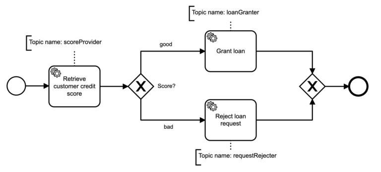

# 教程

本篇教程将带你学习如何利用 `Java` 以及 `Camunda` 相关框架搭建基于 `BPMN 2.0` 的**工作流引擎**  
本教程假设你已拥有基础的 `Java`、`Spring Boot`、`BPMN 2.0` 相关知识

## 准备工作

1. 进入 [spring initializr](https://start.spring.io) 创建 `maven` 项目，**语言**选择 `Java`，**Spring Boot** 版本选择 `2.4.*`，设定项目元信息，**打包方式**选择 `jar`，**Java** 版本选择 `8`，添加 `H2 Database`、`Lombok` 依赖，最后点击 **GENERATE** 生成项目并下载到本地  
      
    > `Camunda 7.15.0`  与 `Spring Boot 2.4.*` 兼容  
2. 使用 **IDE** 打开项目，在 `pom.xml` 中手动添加 `camunda` 依赖
    ```xml
    <!-- 在properties标签内添加以下内容 -->
    <camunda.spring-boot.version>7.15.0</camunda.spring-boot.version>
    <!-- 在dependencies标签内添加以下内容 -->
    <dependency>
        <groupId>org.camunda.bpm.springboot</groupId>
        <artifactId>camunda-bpm-spring-boot-starter-webapp</artifactId>
        <version>${camunda.spring-boot.version}</version>
    </dependency>
    <dependency>
        <groupId>org.camunda.bpm.springboot</groupId>
        <artifactId>camunda-bpm-spring-boot-starter-rest</artifactId>
        <version>${camunda.spring-boot.version}</version>
    </dependency>
    <dependency>
        <groupId>org.camunda.bpm.springboot</groupId>
        <artifactId>camunda-bpm-spring-boot-starter-external-task-client</artifactId>
        <version>${camunda.spring-boot.version}</version>
    </dependency>
    ```
3. 下载依赖并构建，测试是否可运行
4. 下载 [Camunda Modeler](https://camunda.com/download/modeler/) 并解压，待后续使用

## `Camunda` 工作流

### 配置账户

在资源根目录添加 `application.yml`，添加以下内容
```yaml
server:
  port: 8080

camunda.bpm:
  admin-user:
    id: demo
    password: demo
    firstName: Demo
  filter:
    create: All tasks
```
这将创建一个名为 `Demo` 的管理员，账户ID为 `demo`，账户密码为 `demo`，并且部署资源目录下所有 `**/*.bpmn` 定义的任务  

> 值得注意的是在该文件中并不需要配置数据源，因为本教程使用 `H2` 嵌入式内存数据库  

### 创建并实现流程

1. 下载 [loan-granting.bpmn](src/main/resources/processes/loan-granting.bpmn)，并将其置于资源目录中的 `processes/` 路径下  
   > 该文件定义了一个如下流程，包含3个服务任务和2个网关，其中的服务任务可以通过 `Java` 等语言实现，并根据话题名注册  
   > 
2. 在 `application.yml` 中添加以下内容
    ```yaml
    # camunda.bpm:
    client:
      base-url: http://localhost:${server.port}/engine-rest
      lock-duration: 10000
      subscriptions:
        scoreProvider:
          variable-names: []
          process-definition-key: loan_process
        loanGranter:
          variable-names: customerId, creditScore
          process-definition-key: loan_process
        requestRejecter:
          variable-names: customerId, creditScore
          process-definition-key: loan_process
    ```
    `camunda.bpm.client.base-url` 定义了外部任务客户端调用的 `REST API` 根路径，这些 `API` 由 `camunda-bpm-spring-boot-starter-rest` 实现  
    `camunda.bpm.client.lock-duration` 定义了外部任务被取回后的锁定时长，单位为毫秒  
    `camunda.bpm.client.subscriptions` 下定义了对应话题名的外部服务任务所需的变量以及流程定义键名  
3. 在 `<basePackage>.process.handler.loanGranting` 包下添加以下外服服务任务实现类  

    `ProvideScoreHandler.java`
    ```java
    package org.bkcloud.fleet.workflow.process.handler.loanGranting;

    import org.camunda.bpm.client.spring.annotation.ExternalTaskSubscription;
    import org.camunda.bpm.client.task.ExternalTask;
    import org.camunda.bpm.client.task.ExternalTaskHandler;
    import org.camunda.bpm.client.task.ExternalTaskService;
    import org.camunda.bpm.engine.variable.VariableMap;
    import org.camunda.bpm.engine.variable.Variables;
    import org.springframework.stereotype.Component;

    import java.text.MessageFormat;
    import java.util.UUID;

    @Component
    @ExternalTaskSubscription("scoreProvider")
    public class ProvideScoreHandler implements ExternalTaskHandler {
        @Override
        public void execute(ExternalTask externalTask, ExternalTaskService externalTaskService) {
            String customID = "C-" + UUID.randomUUID().toString().substring(32);
            int creditScore = (int) (Math.random() * 11);

            VariableMap map = Variables.createVariables();
            map.put("customID", customID);
            map.put("creditScore", creditScore);

            externalTaskService.complete(externalTask, map);

            String msg = MessageFormat.format("Credit score {0} for custom {1} provided", creditScore, customID);
            System.out.println(msg);
        }
    }
    ```
    该类通过 `@ExternalTaskSubscription` 注解注册到指定话题名下，并以 `UUID` 生成客户ID，以 `random` 方法生成一个随机的信用评分，将变量存入 `VariableMap` 中，最终调用 `ExternalTaskService::complete` 将变量存入流程实例  

    `GrantLoanHandler.java`
    ```java
    package org.bkcloud.fleet.workflow.process.handler.loanGranting;

    import org.camunda.bpm.client.spring.annotation.ExternalTaskSubscription;
    import org.camunda.bpm.client.task.ExternalTask;
    import org.camunda.bpm.client.task.ExternalTaskHandler;
    import org.camunda.bpm.client.task.ExternalTaskService;
    import org.springframework.stereotype.Component;

    import java.text.MessageFormat;

    @Component
    @ExternalTaskSubscription("loanGranter")
    public class GrantLoanHandler implements ExternalTaskHandler {
        @Override
        public void execute(ExternalTask externalTask, ExternalTaskService externalTaskService) {
            String customID = externalTask.getVariable("customID");
            int creditScore = externalTask.getVariable("creditScore");

            externalTaskService.complete(externalTask);

            String msg = MessageFormat.format("loan granted for custom {0} with score {1}", customID, creditScore);
            System.out.println(msg);
        }
    }
    ```
    当上一步生成的信用评分大于5时，进入 `good` 分支，调用此实现类，通过 `ExternalTask::getVariable` 获取流程实例中定义的变量，并打印相关信息  

    `RequestRejecterHandler.java`
    ```java
    package org.bkcloud.fleet.workflow.process.handler.loanGranting;

    import org.camunda.bpm.client.spring.annotation.ExternalTaskSubscription;
    import org.camunda.bpm.client.task.ExternalTask;
    import org.camunda.bpm.client.task.ExternalTaskHandler;
    import org.camunda.bpm.client.task.ExternalTaskService;
    import org.springframework.stereotype.Component;

    import java.text.MessageFormat;

    @Component
    @ExternalTaskSubscription("requestRejecter")
    public class RequestRejecterHandler implements ExternalTaskHandler {
        @Override
        public void execute(ExternalTask externalTask, ExternalTaskService externalTaskService) {
            String customID = externalTask.getVariable("customID");
            int creditScore = externalTask.getVariable("creditScore");

            externalTaskService.complete(externalTask);

            String msg = MessageFormat.format("request rejected for custom {0} with score {1}", customID, creditScore);
            System.out.println(msg);
        }
    }
    ```
    当上一步生成的信用评分小于等于5时，进入 `bad` 分支，处理方法类似
4. 方便起见，在 `<basePackage>.process` 包下添加以下类，用于在流程部署后启动一个流程实例  
    `LoanProcess.java`
    ```java
    package org.bkcloud.fleet.workflow.process;

    import org.camunda.bpm.engine.RuntimeService;
    import org.camunda.bpm.spring.boot.starter.event.PostDeployEvent;
    import org.springframework.beans.factory.annotation.Autowired;
    import org.springframework.context.event.EventListener;
    import org.springframework.stereotype.Component;

    @Component
    public class LoanProcess {

        @Autowired
        private RuntimeService runtimeService;

        @EventListener
        public void processPostDeploy(PostDeployEvent event) {
            runtimeService.startProcessInstanceByKey("loan_process");
        }
    }
    ```
    `@EventListener` 注解定义了一个事件监听器，用来监听 `PostDeployEvent` 事件，并在事件发生时被调用  
    `processPostDeploy` 方法会调用 `RuntimeService::startProcessInstanceByKey` 方法，启动一个指定键名的流程实例  
5. 运行 `WorkflowApplication` 启动类的 `main` 方法，若在控制台中看到类似如下信息，说明流程实例启动成功  
    ```
    Credit score 2 for custom C-ca4e provided
    request rejected for custom C-ca4e with score 2
    ```
    > 流程实例还可以通过 `REST API`、`Web App` 等方式启动，具体方法见后续内容

### 通过 `REST API` 启动流程实例

在项目运行的情况下，向 `http://localhost:8080/engine-rest/process-definition/key/loan_process/start` 发送 `POST` 请求
```
curl http://localhost:8080/engine-rest/process-definition/key/loan_process/start -X POST
```

若获取到类似如下 `response`，说明流程实例启动成功

```json
{
    "links": [{
        "method": "GET",
        "href": "http://localhost:8080/engine-rest/process-instance/0daa546b-d282-11eb-b654-76e5f95e3e45",
        "rel": "self"
    }],
    "id": "0daa546b-d282-11eb-b654-76e5f95e3e45",
    "definitionId": "loan_process:1:00c5946c-d27f-11eb-b654-76e5f95e3e45",
    "businessKey": null,
    "caseInstanceId": null,
    "ended": false,
    "suspended": false,
    "tenantId": null
}
```

### 通过 **Web App** 启动流程实例

1. 为启动类添加 `@EnableProcessApplication` 注解，运行项目
2. 访问[控制台](http://localhost:8080/camunda/app/welcome/default/#!/login)，以 `application.yml` 中设置的账号密码登录
3. 进入 **Tasklist**，点击右上角的 **Start process** 按钮，选择 **Grant Loans** 流程，点击 **Start** 按钮启动流程实例，此时可以看到控制台中新增2行类似如下信息
    ```
    Credit score 10 for custom C-c6f7 provided
    loan granted for custom C-c6f7 with score 10
    ```

### 通过 **Web App** 做出决策

1. 打开 `Camunda Modeler`，创建一个如下的流程模型，并保存为资源路径下的 `processes/loanApproval.bpmn`  
   
   
   > 提示：如果你不熟悉如何创建流程模型，可以访问[该教程](https://docs.camunda.org/get-started/quick-start/service-task/)  
2. 方便起见，在 `<basePackage>.process` 包下添加以下类，用于在流程部署后启动一个流程实例  
    `LoanApprovalProcess.java`
    ```java
    package org.bkcloud.fleet.workflow.process;

    import org.camunda.bpm.engine.RuntimeService;
    import org.camunda.bpm.spring.boot.starter.event.PostDeployEvent;
    import org.springframework.beans.factory.annotation.Autowired;
    import org.springframework.context.event.EventListener;
    import org.springframework.stereotype.Component;

    @Component
    public class LoanApprovalProcess {

        @Autowired
        private RuntimeService runtimeService;

        @EventListener
        public void processPostDeploy(PostDeployEvent event) {
            runtimeService.startProcessInstanceByKey("loanApproval");
        }
    }
    ```
3. 之后，重新启动项目，登录 **Web App**， 进入**Tasklist**，可以在 **All tasks** 过滤器下看到 `loanApproval` 被启动  
   
4. 点击 **Loan Approval** 任务，点击右侧的 **claim** 按钮，之后便可以对该用户任务做出决策，最终点击 **complete** 按钮完成用户任务

## 微服务

**`Spring Cloud` 的 `2020.0.0` 以上版本不会自动读取 `bootstrap` 配置文件，需额外引入 `org.springframework.cloud:spring-cloud-starter-bootstrap` 依赖**  

若要把该项目转化为微服务，需要创建2个模块：

* `workflow`: 仅包含启动类，引入 `camunda-bpm-spring-boot-starter-webapp` 和 `camunda-bpm-spring-boot-starter-rest` 依赖，负责提供 **Web App** 以及 `REST API`
* `task`: 包含启动类和其他用于处理工作流的类，引入 `camunda-bpm-spring-boot-starter-external-task-client` 依赖，启动类无需添加 `@EnableProcessApplication` 注解，负责处理服务任务等其他内容
