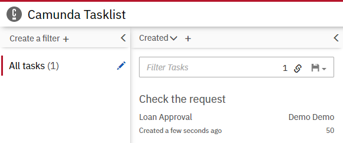

# 教程

本篇教程将带你学习如何利用`Java`以及`camunda`、`quartz`、`freemarker`框架搭建基于**工作流引擎**和**代码生成器**的低代码CI/CD后端  
本教程假设你已拥有基础的`Java`、`Spring Boot`、`Spring Data JPA`、`BPMN 2.0`相关知识

## 准备工作

1. 进入 [srping initializr](https://start.spring.io) 创建`maven`项目，**语言**选择`Java`，**Spring Boot** 版本选择`2.3.x`，设定项目元信息，**打包方式**选择`jar`，**Java** 版本选择`8`，添加`H2 Database`、`Quartz Scheduler`、`Apache Freemarker`、`Spring Data Jpa`、`Lombok`依赖，点击`GENERATE`生成项目并下载到本地
2. 使用IDE打开项目，在`pom.xml`中手动添加`camunda`依赖
    ```xml
    <!-- 在properties标签内添加以下内容 -->
    <camunda.spring-boot.version>7.15.0</camunda.spring-boot.version>
    <camunda.template-engine-freemarker.version>2.0.0</camunda.template-engine-freemarker.version>
    <!-- 在dependencies标签内添加以下内容 -->
    <dependency>
        <groupId>org.camunda.bpm.springboot</groupId>
        <artifactId>camunda-bpm-spring-boot-starter-webapp</artifactId>
        <version>${camunda.spring-boot.version}</version>
    </dependency>
    <dependency>
        <groupId>com.sun.xml.bind</groupId>
        <artifactId>jaxb-impl</artifactId>
        <version>2.2.3</version>
    </dependency>
    <dependency>
        <groupId>org.camunda.template-engines</groupId>
        <artifactId>camunda-template-engines-freemarker</artifactId>
        <version>${camunda.template-engine-freemarker.version}</version>
    </dependency>
    ```
3. 下载依赖并构建，测试是否可运行
4. 下载 [Camunda Modeler](https://camunda.com/download/modeler/) 并解压，待后续使用

## `camunda`工作流

### 配置账户

1. 在资源根目录添加`application.yml`，添加以下内容
    ```yaml
    camunda.bpm:
        admin-user:
        id: demo
        password: demo
        firstName: Demo
        filter:
        create: All tasks
    ```
   这将创建一个名为`Demo`的管理员，账户ID为`demo`，账户密码为`demo`，并且部署资源目录下所有`**/*.bpmn`定义的任务  
   
   > 值得注意的是在该文件中并不需要配置数据源，因为本教程使用`H2`嵌入式内存数据库  
2. 运行`main`方法，访问[控制台](http://localhost:8080)，以定义好的ID、密码登录，之后，便可以在 **Tasklist** 中看到一个用来显示所有任务的 **All tasks** 过滤器

### 创建流程模型

1. 打开`Camunda Modeler`，创建一个如下的流程模型  
   
   
   > 提示：如果你不熟悉如何创建流程模型，可以访问[该教程](https://docs.camunda.org/get-started/quick-start/service-task/)  
   
2. 将该流程模型保存为资源目录下的`processes/loanApproval.bpmn`
3. 在主类上添加`@EnableProcessApplication`注解，这将创建流程应用
4. 在`<basePackage>.process.LoanApproval`类中添加以下代码，这将使`loanApproval`流程实例被部署后自动执行
    ```java
    package org.bkcloud.fleet.workflow.process;
    
    import org.camunda.bpm.engine.RuntimeService;
    import org.camunda.bpm.spring.boot.starter.event.PostDeployEvent;
    import org.springframework.beans.factory.annotation.Autowired;
    import org.springframework.context.event.EventListener;
    import org.springframework.stereotype.Component;
    
    @Component
    public class LoanApproval {
    
        @Autowired
        private RuntimeService runtimeService;
    
        @EventListener
        public void processPostDeploy(PostDeployEvent event) {
            runtimeService.startProcessInstanceByKey("loanApproval");
        }
    }
    ```
    `processPostDeploy`方法定义了流程实例被部署后要执行的代码
5. 之后，重新启动应用，可以在 **All tasks** 过滤器下看到`loanApproval`被启动  
   

## `quartz`作业调度器

### 配置调度器

在资源目录下的`application.yml`中添加以下内容
```yaml
spring:
  quartz:
    job-store-type: jdbc
    properties.org.quartz:
      scheduler:
        instanceId: AUTO
      threadPool:
        threadCount: 4
```
`spring.quartz.job-store-type`指定了将作业存储进数据库

### 添加作业

在`<basePackage>.job.Greet`类中添加以下代码
```java
package org.bkcloud.fleet.workflow.job;

import org.quartz.Job;
import org.quartz.JobExecutionContext;
import org.quartz.JobExecutionException;

public class Greet implements Job {
   @Override
   public void execute(JobExecutionContext jobExecutionContext) throws JobExecutionException {
      System.out.println("Hello world!");
   }
}
```
`execute`方法定义了任务要执行的代码

### 配置作业、触发器

在`<basePackage>.config.QuartzConfiguration`类中添加以下代码
```java
package org.bkcloud.fleet.workflow.config;

import org.bkcloud.fleet.workflow.job.Greet;
import org.quartz.*;
import org.springframework.context.annotation.Bean;
import org.springframework.context.annotation.Configuration;

@Configuration
public class QuartzConfiguration {

   @Bean
   public JobDetail jobDetail() {
      return JobBuilder.newJob(Greet.class).withIdentity("demo job").storeDurably().build();
   }

   @Bean
   public Trigger jobTrigger(JobDetail jobDetail) {
      return TriggerBuilder.newTrigger().forJob(jobDetail).withIdentity("demo trigger")
              .withSchedule(CronScheduleBuilder.cronSchedule("0/10 * * ? * * *"))
              .build();
   }
}
```
`jobDetail`将为`Greet`作业配置详细的设定，之后`jobTrigger`将以`jobDetail`中的配置配置触发器，并以**Cron表达式**指定该触发器每10秒触发一次

> #### Cron表达式  
> 以7个值构成，从左到右依次为秒、分、时、日、月、一周中的第几天、年，最后一个参数可选，以空格分割  
> 可以用`*`代表所有值，`-`指定范围，`?`表示忽略，`,`分割多个值  
> 可以用`/`分割数字指定初始值和每次递增的值  
> 可以用`L`在**日**字段指定本月最后一天，在**周**字段指定周六  
> 可以用数字+`L`在**周**字段指定本月最后一个周几  
> 可以在**日**字段用数字+`W`指定本月最接近该日期的工作日，或用`LW`指定本月最后一个工作日  
> 可以用`#`分割数字在**周**字段指定本月周几中的第几个  
> 可以用数字+`C`在**日**和**周**字段指定该天或之后第一次包含任务的那天  

### 执行

执行`main`方法，待应用启动完成后，便可以看到控制台中每10秒打印一行`Hello world!`

## `freemarker`模板引擎

在`camunda`中，你可以在任何使用脚本的位置使用`freemarker`模板引擎，例如 **script task** 和 **inputOutput Mapping**  
在模板引擎中，所有的流程变量都可用  
模板/脚本可以用以下方式加载
* 表达式：`<script>${sourceCode}</script>`
* 系统路径：`<scriptTask scriptFormat="groovy" camunda:resource="org/camunda/bpm/task.groovy"/>`
* 类路径：`<scriptTask scriptFormat="groovy" camunda:resource="classpath://org/camunda/bpm/task.groovy"/>`
* 部署路径：`<scriptTask scriptFormat="groovy" camunda:resource="deployment://org/camunda/bpm/task.groovy"/>`

### 编写模板引擎类

在`<basePackage>.scriptEngine.FreemarkerScriptEngine`类中添加以下代码
```java
package org.bkcloud.fleet.workflow.scriptEngine;

import freemarker.template.Configuration;
import freemarker.template.Template;
import freemarker.template.TemplateException;
import freemarker.template.Version;
import org.camunda.templateengines.FreeMarkerCompiledScript;
import org.springframework.stereotype.Component;

import javax.script.*;
import java.io.*;

@Component
public class FreemarkerScriptEngine extends AbstractScriptEngine implements Compilable {

    private final ScriptEngineFactory factory;
    private final Configuration configuration;

    public FreemarkerScriptEngine(ScriptEngineFactory factory) {
        this.factory = factory;
        this.configuration = new Configuration(new Version(factory.getEngineVersion()));
    }

    @Override
    public CompiledScript compile(String script) throws ScriptException {
        return compile(new StringReader(script));
    }

    @Override
    public CompiledScript compile(Reader script) throws ScriptException {
        return new FreeMarkerCompiledScript(this, script, configuration);
    }

    @Override
    public Object eval(String script, ScriptContext context) throws ScriptException {
        return eval(new StringReader(script), context);
    }

    @Override
    public Object eval(Reader reader, ScriptContext context) throws ScriptException {
        String filename = (String) context.getAttribute(ScriptEngine.FILENAME);
        Writer writer = new StringWriter();
        Bindings bindings = context.getBindings(ScriptContext.ENGINE_SCOPE);

        try {
            Template template = new Template(filename, reader, configuration);
            template.process(bindings, writer);
            writer.flush();
        } catch (IOException | TemplateException e) {
            throw new ScriptException(e);
        }

        return writer.toString();
    }

    @Override
    public Bindings createBindings() {
        return new SimpleBindings();
    }

    @Override
    public ScriptEngineFactory getFactory() {
        return this.factory;
    }
}
```
这个类将使用`FreemarkerScriptEngineFactory`创建并获取配置，`compile`方法定义了该类如何编译脚本，`eval`方法定义了该类如何将模板渲染成字符串

### 编写模板引擎工厂

在`<basePackage>.scriptEngine.factory.FreemarkerScriptEngineFactory`类中添加以下代码
```java
package org.bkcloud.fleet.workflow.scriptEngine.factory;

import org.bkcloud.fleet.workflow.scriptEngine.FreemarkerScriptEngine;
import org.springframework.stereotype.Component;

import javax.script.ScriptEngine;
import javax.script.ScriptEngineFactory;
import java.util.Arrays;
import java.util.Collections;
import java.util.List;

@Component
public class FreemarkerScriptEngineFactory implements ScriptEngineFactory {

    public final static String NAME = "freemarker";
    public final static String VERSION = "2.3.29";
    public final static List<String> names;
    public final static List<String> extensions;
    public final static List<String> mimeTypes;

    static {
        names = Collections.unmodifiableList(Arrays.asList(NAME, "Freemarker", "FreeMarker"));
        extensions = Collections.singletonList("ftl");
        mimeTypes = Collections.emptyList();
    }

    @Override
    public String getEngineName() {
        return NAME;
    }

    @Override
    public String getEngineVersion() {
        return VERSION;
    }

    @Override
    public List<String> getExtensions() {
        return extensions;
    }

    @Override
    public List<String> getMimeTypes() {
        return mimeTypes;
    }

    @Override
    public List<String> getNames() {
        return names;
    }

    @Override
    public String getLanguageName() {
        return NAME;
    }

    @Override
    public String getLanguageVersion() {
        return VERSION;
    }

    @Override
    public Object getParameter(String key) {
        switch (key) {
            case ScriptEngine.NAME:
            case ScriptEngine.LANGUAGE:
                return getLanguageName();
            case ScriptEngine.ENGINE:
                return getEngineName();
            case ScriptEngine.ENGINE_VERSION:
                return getEngineVersion();
            case ScriptEngine.LANGUAGE_VERSION:
                return getLanguageVersion();
            case "THREADING":
                return "MULTITHREADED";
            default:
                return null;
        }
    }

    @Override
    public String getMethodCallSyntax(String obj, String m, String... args) {
        String params = args == null ? "" : String.join(", ", args);
        return "${" + obj + "." + m + "(" + params + ")}";
    }

    @Override
    public String getOutputStatement(String toDisplay) {
        return toDisplay;
    }

    @Override
    public String getProgram(String... statements) {
        return statements == null ? null : String.join("\n", statements);
    }

    @Override
    public ScriptEngine getScriptEngine() {
        return new FreemarkerScriptEngine(this);
    }
}
```
该类定义了一些工厂的元信息，以及通过`getScriptEngine`获取`FreemarkerScriptEngine`的方法

### 编写模板

以下例子展示了如何编写`freemarker`模板，并将结果存储到`text`变量中
```xml
<scriptTask id="templateScript" scriptFormat="freemarker" camunda:resultVariable="text">
  <script>
    <![CDATA[
    Dear ${customer},

    thank you for working with Camunda Platform ${version}.

    Greetings,
    Camunda Developers
    ]]>
  </script>
</scriptTask>
```
> 在`xml`文档中，使用`CDATA`区段可以防止中间的文本被解析，方便编写代码

### 配置模板

在资源目录下的`application.yml`中添加以下内容
```yaml
# spring:
  freemarker:
    template-loader-path: classpath:/templates/
    suffix: .ftl
```
这将会使`freemarker`从`classpath:/templates/`下加载后缀为`ftl`的模板文件
