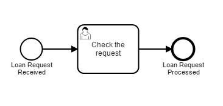

# 教程

本篇教程将带你学习如何利用`Java`以及`camunda`、`quartz`、`freemarker`框架搭建基于**工作流引擎**和**代码生成器**的低代码CI/CD后端  
本教程假设你已拥有基础的`Java`、`Spring Boot`、`BPMN 2.0`相关知识

## 准备工作

1. 进入 [srping initializr](https://start.spring.io) 创建`maven`项目，**语言**选择`Java`，**Spring Boot** 版本选择`2.3.x`，设定项目元信息，**打包方式**选择`jar`，**Java** 版本选择`8`，添加`H2 Database`、`Quartz Scheduler`、`Apache Freemarker`、`Lombok`依赖，点击`GENERATE`生成项目并下载到本地  
    
2. 使用IDE打开项目，在`pom.xml`中手动添加`camunda`依赖
    ```xml
    <!-- 在properties标签内添加以下内容 -->
    <camunda.spring-boot.version>7.15.0</camunda.spring-boot.version>
    <!-- 在dependencies标签内添加以下内容 -->
    <dependency>
        <groupId>org.camunda.bpm.springboot</groupId>
        <artifactId>camunda-bpm-spring-boot-starter-webapp</artifactId>
        <version>${camunda.spring-boot.version}</version>
    </dependency>
    ```
3. 下载依赖并构建，测试是否可运行
4. 下载 [Camunda Modeler](https://camunda.com/download/modeler/) 并解压，待后续使用

## `camunda`工作流

### 配置账户

1. 在资源根目录添加`application.yml`，添加以下内容
    ```yaml
    camunda.bpm:
        admin-user:
        id: demo
        password: demo
        firstName: Demo
        filter:
        create: All tasks
    ```
   这将创建一个名为`Demo`的管理员，账户ID为`demo`，账户密码为`demo`，并且部署资源目录下所有`**/*.bpmn`定义的任务  
   
   > 值得注意的是在该文件中并不需要配置数据源，因为本教程使用`H2`嵌入式内存数据库  
2. 运行`main`方法，访问[控制台](http://localhost:8080)，以定义好的ID、密码登录，之后，便可以在 **Tasklist** 中看到一个用来显示所有任务的 **All tasks** 过滤器

### 创建流程模型

1. 打开`Camunda Modeler`，创建一个如下的流程模型  
   
   
   > 提示：如果你不熟悉如何创建流程模型，可以访问[该教程](https://docs.camunda.org/get-started/quick-start/service-task/)  
   
2. 将该流程模型保存为资源目录下的`processes/loanApproval.bpmn`
3. 在主类上添加`@EnableProcessApplication`注解，这将创建流程应用
4. 在`<basePackage>.process.LoanApprovalProcess`类中添加以下代码，这将使`loanApproval`流程实例被部署后自动执行
    ```java
    package org.bkcloud.fleet.workflow.process;
    
    import org.camunda.bpm.engine.RuntimeService;
    import org.camunda.bpm.spring.boot.starter.event.PostDeployEvent;
    import org.springframework.beans.factory.annotation.Autowired;
    import org.springframework.context.event.EventListener;
    import org.springframework.stereotype.Component;
    
    @Component
    public class LoanApprovalProcess {
    
        @Autowired
        private RuntimeService runtimeService;
    
        @EventListener
        public void processPostDeploy(PostDeployEvent event) {
            runtimeService.startProcessInstanceByKey("loanApproval");
        }
    }
    ```
    `processPostDeploy`方法定义了流程实例被部署后要执行的代码
5. 之后，重新启动应用，可以在 **All tasks** 过滤器下看到`loanApproval`被启动  
   

## `quartz`作业调度器

### 配置调度器

在资源目录下的`application.yml`中添加以下内容
```yaml
spring:
  quartz:
    job-store-type: jdbc
    properties.org.quartz:
      scheduler:
        instanceId: AUTO
      threadPool:
        threadCount: 4
```
`spring.quartz.job-store-type`指定了将作业存储进数据库

### 添加作业

在`<basePackage>.job.Greet`类中添加以下代码
```java
package org.bkcloud.fleet.workflow.job;

import org.quartz.Job;
import org.quartz.JobExecutionContext;
import org.quartz.JobExecutionException;

public class Greet implements Job {
   @Override
   public void execute(JobExecutionContext jobExecutionContext) throws JobExecutionException {
      System.out.println("Hello world!");
   }
}
```
`execute`方法定义了任务要执行的代码

### 配置作业、触发器

在`<basePackage>.config.QuartzConfiguration`类中添加以下代码

```java
package org.bkcloud.fleet.workflow.config;

import org.quartz.*;
import org.springframework.context.annotation.Bean;
import org.springframework.context.annotation.Configuration;

@Configuration
public class QuartzConfiguration {

    @Bean
    public JobDetail jobDetail() {
        return JobBuilder.newJob(Greet.class).withIdentity("demo job").storeDurably().build();
    }

    @Bean
    public Trigger jobTrigger(JobDetail jobDetail) {
        return TriggerBuilder.newTrigger().forJob(jobDetail).withIdentity("demo trigger")
                .withSchedule(CronScheduleBuilder.cronSchedule("0/10 * * ? * * *"))
                .build();
    }
}
```
`jobDetail`将为`Greet`作业配置详细的设定，之后`jobTrigger`将以`jobDetail`中的配置配置触发器，并以**Cron表达式**指定该触发器每10秒触发一次

> #### Cron表达式  
> 以7个值构成，从左到右依次为秒、分、时、日、月、一周中的第几天、年，最后一个参数可选，以空格分割  
> 可以用`*`代表所有值，`-`指定范围，`?`表示忽略，`,`分割多个值  
> 可以用`/`分割数字指定初始值和每次递增的值  
> 可以用`L`在**日**字段指定本月最后一天，在**周**字段指定周六  
> 可以用数字+`L`在**周**字段指定本月最后一个周几  
> 可以在**日**字段用数字+`W`指定本月最接近该日期的工作日，或用`LW`指定本月最后一个工作日  
> 可以用`#`分割数字在**周**字段指定本月周几中的第几个  
> 可以用数字+`C`在**日**和**周**字段指定该天或之后第一次包含任务的那天  

### 执行

执行`main`方法，待应用启动完成后，便可以看到控制台中每10秒打印一行`Hello world!`

## `freemarker`模板引擎

在`camunda`中，你可以在任何使用脚本的位置使用`freemarker`模板引擎，例如 **script task** 和 **inputOutput Mapping**  
在模板引擎中，所有的流程变量都可用  
模板/脚本可以用以下方式加载
* 表达式：`<script>${sourceCode}</script>`
* 系统路径：`<scriptTask scriptFormat="groovy" camunda:resource="org/camunda/bpm/task.groovy"/>`
* 类路径：`<scriptTask scriptFormat="groovy" camunda:resource="classpath://org/camunda/bpm/task.groovy"/>`
* 部署路径：`<scriptTask scriptFormat="groovy" camunda:resource="deployment://org/camunda/bpm/task.groovy"/>`

### 编写模板引擎类

在`<basePackage>.scriptEngine.FreemarkerScriptEngine`类中添加以下代码
```java
package org.bkcloud.fleet.workflow.scriptEngine;

import freemarker.cache.ClassTemplateLoader;
import freemarker.template.Configuration;
import freemarker.template.Template;
import freemarker.template.TemplateException;
import freemarker.template.Version;
import org.camunda.templateengines.FreeMarkerCompiledScript;
import org.springframework.stereotype.Component;

import javax.script.*;
import java.io.*;

@Component
public class FreemarkerScriptEngine extends AbstractScriptEngine implements Compilable {

    private final ScriptEngineFactory factory;
    private final Configuration configuration;

    public FreemarkerScriptEngine(ScriptEngineFactory factory) {
        this.factory = factory;
        this.configuration = new Configuration(Configuration.VERSION_2_3_31);
        ClassTemplateLoader loader = new ClassTemplateLoader(FreemarkerScriptEngine.class, "/templates/");
        configuration.setTemplateLoader(loader);
    }

    @Override
    public CompiledScript compile(String script) throws ScriptException {
        return compile(new StringReader(script));
    }

    @Override
    public CompiledScript compile(Reader script) throws ScriptException {
        return new FreeMarkerCompiledScript(this, script, configuration);
    }

    @Override
    public Object eval(String script, ScriptContext context) throws ScriptException {
        return eval(new StringReader(script), context);
    }

    @Override
    public Object eval(Reader reader, ScriptContext context) throws ScriptException {
        String filename = (String) context.getAttribute(ScriptEngine.FILENAME);
        Writer writer = new StringWriter();
        Bindings bindings = context.getBindings(ScriptContext.ENGINE_SCOPE);

        try {
            Template template = new Template(filename, reader, configuration);
            template.process(bindings, writer);
            writer.flush();
        } catch (IOException | TemplateException e) {
            throw new ScriptException(e);
        }

        return writer.toString();
    }

    @Override
    public Bindings createBindings() {
        return new SimpleBindings();
    }

    @Override
    public ScriptEngineFactory getFactory() {
        return this.factory;
    }

    public Configuration getConfiguration() {
        return configuration;
    }
}
```
这个类将使用`FreemarkerScriptEngineFactory`创建并获取配置，`compile`方法定义了该类如何编译脚本，`eval`方法定义了该类如何将模板渲染成字符串

### 编写模板引擎工厂

在`<basePackage>.scriptEngine.factory.FreemarkerScriptEngineFactory`类中添加以下代码
```java
package org.bkcloud.fleet.workflow.scriptEngine.factory;

import org.bkcloud.fleet.workflow.scriptEngine.FreemarkerScriptEngine;
import org.springframework.stereotype.Component;

import javax.script.ScriptEngine;
import javax.script.ScriptEngineFactory;
import java.util.Arrays;
import java.util.Collections;
import java.util.List;

@Component
public class FreemarkerScriptEngineFactory implements ScriptEngineFactory {

    public final static String NAME = "freemarker";
    public final static String VERSION = "2.3.29";
    public final static List<String> names;
    public final static List<String> extensions;
    public final static List<String> mimeTypes;

    static {
        names = Collections.unmodifiableList(Arrays.asList(NAME, "Freemarker", "FreeMarker"));
        extensions = Collections.singletonList("ftl");
        mimeTypes = Collections.emptyList();
    }

    @Override
    public String getEngineName() {
        return NAME;
    }

    @Override
    public String getEngineVersion() {
        return VERSION;
    }

    @Override
    public List<String> getExtensions() {
        return extensions;
    }

    @Override
    public List<String> getMimeTypes() {
        return mimeTypes;
    }

    @Override
    public List<String> getNames() {
        return names;
    }

    @Override
    public String getLanguageName() {
        return NAME;
    }

    @Override
    public String getLanguageVersion() {
        return VERSION;
    }

    @Override
    public Object getParameter(String key) {
        switch (key) {
            case ScriptEngine.NAME:
            case ScriptEngine.LANGUAGE:
                return getLanguageName();
            case ScriptEngine.ENGINE:
                return getEngineName();
            case ScriptEngine.ENGINE_VERSION:
                return getEngineVersion();
            case ScriptEngine.LANGUAGE_VERSION:
                return getLanguageVersion();
            case "THREADING":
                return "MULTITHREADED";
            default:
                return null;
        }
    }

    @Override
    public String getMethodCallSyntax(String obj, String m, String... args) {
        String params = args == null ? "" : String.join(", ", args);
        return "${" + obj + "." + m + "(" + params + ")}";
    }

    @Override
    public String getOutputStatement(String toDisplay) {
        return toDisplay;
    }

    @Override
    public String getProgram(String... statements) {
        return statements == null ? null : String.join("\n", statements);
    }

    @Override
    public ScriptEngine getScriptEngine() {
        return new FreemarkerScriptEngine(this);
    }
}
```
该类定义了一些工厂的元信息，以及通过`getScriptEngine`获取`FreemarkerScriptEngine`的方法

### 编写模板

在资源目录下的`templates/runScript.ftl`中添加以下内容
```xml
<?xml version="1.0" encoding="UTF-8"?>
<definitions xmlns="http://www.omg.org/spec/BPMN/20100524/MODEL" targetNamespace="http://camunda.org/example">
  <process id="runScript" isExecutable="true">
    <startEvent id="start"/>
    <sequenceFlow id="sequenceFlow1" sourceRef="start" targetRef="task"/>
    <scriptTask id="task" name="Groovy Script" scriptFormat="groovy">
      <script>
        <![CDATA[
        ${source}
        ]]>
      </script>
    </scriptTask>
    <sequenceFlow id="sequenceFlow2" sourceRef="task" targetRef="end"/>
    <endEvent id="end"/>
  </process>
</definitions>
```
> 在`xml`文档中，使用`CDATA`区段可以防止中间的文本被解析，方便编写代码

### 配置模板

在资源目录下的`application.yml`中添加以下内容
```yaml
# spring:
  freemarker:
    template-loader-path: classpath:/templates/
    suffix: .ftl
```
这将会使`freemarker`从`classpath:/templates/`下加载后缀为`ftl`的模板文件

## `camunda`整合`freemarker`

### 创建流程类

在`<basePackage>.process.RunScriptProcess`类中添加以下代码
```java
package org.bkcloud.fleet.workflow.process;

import org.bkcloud.fleet.workflow.scriptEngine.FreemarkerScriptEngine;
import org.bkcloud.fleet.workflow.scriptEngine.factory.FreemarkerScriptEngineFactory;
import org.camunda.bpm.engine.RepositoryService;
import org.camunda.bpm.engine.RuntimeService;
import org.camunda.bpm.engine.repository.DeploymentBuilder;
import org.camunda.bpm.engine.runtime.ProcessInstance;
import org.springframework.beans.factory.annotation.Autowired;
import org.springframework.stereotype.Component;

import javax.script.Bindings;
import javax.script.ScriptException;
import java.io.IOException;

@Component
public class RunScriptProcess {

    @Autowired
    private RepositoryService repositoryService;

    @Autowired
    private RuntimeService runtimeService;

    public DeploymentBuilder create(String source) throws IOException, ScriptException {
        FreemarkerScriptEngine scriptEngine = (FreemarkerScriptEngine) new FreemarkerScriptEngineFactory().getScriptEngine();

        String template = scriptEngine.getConfiguration().getTemplate("runScript.ftl").toString();
        Bindings bindings = scriptEngine.createBindings();
        bindings.put("source", source);
        String content = (String) scriptEngine.eval(template, bindings);

        return repositoryService.createDeployment().addString("runScript.bpmn", content);
    }

    public void deploy(DeploymentBuilder deploymentBuilder) {
        deploymentBuilder.deploy();
    }

    public ProcessInstance start() {
        return runtimeService.startProcessInstanceByKey("runScript");
    }
}
```
该类以`create`方法创建流程，`deploy`方法部署流程，`start`方法启动流程实例

### 创建流程实例POJO类

在`<basePackage>.process.instance.RunScriptProcessInstance`类中添加以下代码
```java
package org.bkcloud.fleet.workflow.process.instance;

import lombok.AllArgsConstructor;
import lombok.Data;
import lombok.NoArgsConstructor;

import java.util.UUID;

@Data
@NoArgsConstructor
@AllArgsConstructor
public class RunScriptProcessInstance {

    private UUID id;
    private String source;

}
```
为了方便起见，该类目前只提供了`id`、`source`两个字段，对于更复杂的实例，可以考虑添加返回值、变量、标准输出、标准错误等字段

### 创建流程服务接口

在`<basePackage>.service.IProcessService`接口中添加以下代码
```java
package org.bkcloud.fleet.workflow.service;

import org.camunda.bpm.engine.repository.DeploymentBuilder;
import org.camunda.bpm.engine.runtime.ProcessInstance;

import javax.script.ScriptException;
import java.io.IOException;

public interface IProcessService {

    DeploymentBuilder create(String source) throws ScriptException, IOException;
    void deploy(DeploymentBuilder builder);
    ProcessInstance start();
}
```
该接口定义了流程服务应具备的功能

### 创建流程服务实现类

在`<basePackage>.service.impl.RunScriptServiceImpl`类中添加以下代码

```java
package org.bkcloud.fleet.workflow.service.impl;

import org.camunda.bpm.engine.repository.DeploymentBuilder;
import org.camunda.bpm.engine.runtime.ProcessInstance;
import org.springframework.beans.factory.annotation.Autowired;
import org.springframework.beans.factory.annotation.Qualifier;
import org.springframework.stereotype.Service;

import javax.script.ScriptException;
import java.io.IOException;

@Service
@Qualifier("RunScriptProcessService")
public class RunScriptProcessServiceImpl implements IProcessService {

   @Autowired
   private RunScriptProcess runScriptProcess;

   @Override
   public DeploymentBuilder create(String source) throws ScriptException, IOException {
      return runScriptProcess.create(source);
   }

   @Override
   public void deploy(DeploymentBuilder builder) {
      runScriptProcess.deploy(builder);
   }

   @Override
   public ProcessInstance start() {
      return runScriptProcess.start();
   }
}
```
该类定义了脚本流程服务的实现方式
> 为了防止接口同名导致注入失败，可以在实现类和注入处上添加注解`@Qualifier("name")`

### 创建脚本流程控制器

在`<basePackage>.controller.RunScriptProcessController`类中添加以下代码

```java
package org.bkcloud.fleet.workflow.controller;

import org.bkcloud.fleet.workflow.process.instance.RunScriptProcessInstance;
import org.camunda.bpm.engine.repository.DeploymentBuilder;
import org.springframework.beans.factory.annotation.Autowired;
import org.springframework.beans.factory.annotation.Qualifier;
import org.springframework.web.bind.annotation.PostMapping;
import org.springframework.web.bind.annotation.RequestBody;
import org.springframework.web.bind.annotation.RequestMapping;
import org.springframework.web.bind.annotation.RestController;

import javax.script.ScriptException;
import java.io.IOException;
import java.util.HashMap;
import java.util.Map;
import java.util.UUID;

@RestController
@RequestMapping("/run-script")
public class RunScriptProcessController {

   @Autowired
   @Qualifier("RunScriptProcessService")
   private IProcessService runScriptProcessService;

   private static final Map<UUID, DeploymentBuilder> map;

   static {
      map = new HashMap<>();
   }

   @PostMapping("/create")
   public RunScriptProcessInstance create(@RequestBody RunScriptProcessInstance instance) throws ScriptException, IOException {
      UUID uuid = UUID.randomUUID();
      DeploymentBuilder builder = runScriptProcessService.create(instance.getSource());
      map.put(uuid, builder);
      instance.setId(uuid);
      return instance;
   }

   @PostMapping("/deploy")
   public void deploy(@RequestBody RunScriptProcessInstance instance) {
      runScriptProcessService.deploy(map.get(instance.getId()));
   }

   @PostMapping("/start")
   public void start() {
      runScriptProcessService.start();
   }
}
```
该类在`/run-script`路径下定义了3个使用 **`POST`** 方法的API，它们均使用`JSON`进行数据传输：
* `/create`：从`source`参数获取要执行的`groovy`脚本，以它为模板渲染出流程并存入`map`，之后返回流程的UUID及脚本
    
    > 安全起见，可以预定义脚本类型，从前端获取类型而不是源码，再以类型在后端获取对应源码并渲染，避免远程执行任意代码漏洞
* `/deploy`：从`id`获取流程的UUID，之后部署对应`id`的流程
* `/start`：启动一个流程实例
    
> 为了执行更复杂的脚本，可以在脚本中定义需要传入的参数，并从该接口获取对应参数，以实现定制流程实例  

> 可以将流程数据包装进`DTO`以获取更加用户友好的返回结果  

### 测试API

1. 向`/run-script/create`发送 **`POST`** 请求，`request body`如下
    ```json
    {"source": "println 'hello'"}
    ```
2. 将第一步返回的`id`作为此步骤的参数，向`/run-script/deploy`发送 **`POST`** 请求，`request body`如下
    ```json
    {"id": "8112966c-e13f-47cb-ac70-7b91c712af88"}
    ```
3. 向`/run-script/start`发送 **`POST`** 请求，此时可以看到控制台新增如下输出
    ```
    hello
    ```
